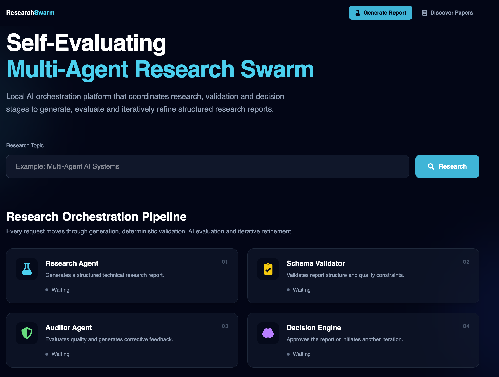
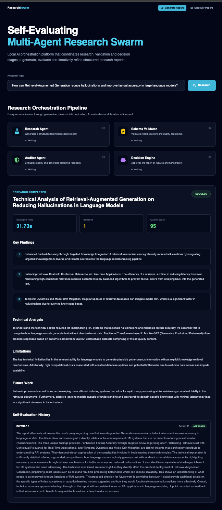
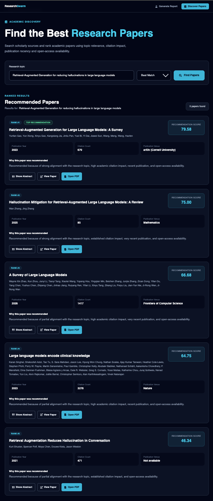

# ResearchSwarm

**Self-Evaluating Multi-Agent Research and Academic Paper Discovery Platform**

ResearchSwarm is an AI-assisted research platform that generates, evaluates and iteratively refines structured research reports while helping users discover and rank relevant academic papers.

The application uses a multi-stage research workflow in which specialized AI components generate reports, validate their structure, evaluate their quality and initiate refinement when required. It also includes an academic paper discovery system that ranks papers using topic relevance, citation impact, publication recency and open-access availability.

> **Repository Scope:** This repository contains the React frontend interface for ResearchSwarm. The research-generation and academic paper-discovery features communicate with backend services during local development.

---

## Application Preview

### Research Orchestration Dashboard

Users can enter a research topic and initiate a structured multi-agent workflow consisting of research generation, schema validation, quality evaluation and iterative decision-making.



### Self-Evaluated Research Report

The system generates a structured technical report containing key findings, technical analysis, limitations and future work. The report is evaluated using an auditing process that assigns a quality score and provides corrective feedback when refinement is required.



### Intelligent Academic Paper Discovery

Users can search for academic papers using a research topic. The system ranks relevant papers using topic relevance, citation impact, publication recency and open-access availability.



---

## Features

### Self-Evaluating Research Dashboard

- Accepts research topics and research questions
- Generates structured AI-assisted research reports
- Displays key findings and technical analysis
- Identifies limitations and future research directions
- Displays report quality scores
- Tracks execution time and refinement iterations
- Visualizes the complete self-evaluation history
- Shows whether a report was approved or required revision

### Academic Paper Discovery

- Searches for academic papers using a research topic
- Displays ranked academic paper recommendations
- Highlights the highest-ranked paper
- Displays paper titles and authors
- Displays publication years
- Displays citation counts
- Displays publication venues
- Shows available paper abstracts
- Provides access to publication pages
- Provides open-access PDF options when available

### Paper Recommendation Criteria

Academic papers are ranked using:

- Topic relevance
- Citation impact
- Publication recency
- Open-access availability

Each paper receives a recommendation score and a short explanation describing why it was recommended.

---

## How It Works

1. The user submits a research question or topic.
2. The Research Agent generates a structured technical report.
3. The Schema Validator verifies the required report structure and output fields.
4. The Auditor Agent evaluates the quality of the generated report and assigns a score.
5. The Decision Engine either approves the report or initiates another refinement iteration.
6. The report is iteratively improved until it satisfies the evaluation criteria or reaches the configured iteration limit.
7. Users can also search for relevant academic papers and view ranked recommendations.

---

## Multi-Agent Research Pipeline

The research workflow consists of four specialized stages:

### 1. Research Agent

Generates a structured technical research report based on the user's research query.

### 2. Schema Validator

Validates the report structure and verifies that all required output fields are present.

### 3. Auditor Agent

Evaluates the quality, relevance, technical depth and consistency of the report. It assigns a quality score and generates corrective feedback when improvement is required.

### 4. Decision Engine

Approves the generated report when it satisfies the evaluation criteria or initiates another refinement iteration.

```text
User Research Query
        │
        ▼
Research Agent
        │
        ▼
Schema Validator
        │
        ▼
Auditor Agent
        │
        ▼
Decision Engine
        │
        ├── Approved ──► Final Research Report
        │
        └── Revision Required
                    │
                    ▼
              Refine Report
                    │
                    └──► Evaluate Again
```

---

## Application Modules

### Generate Report

The research dashboard allows users to submit a research query and view:

- Final report title
- Key research findings
- Technical analysis
- Research limitations
- Future research directions
- Report quality score
- Execution time
- Number of refinement iterations
- Self-evaluation history
- Approval or revision status

### Discover Papers

The academic paper discovery interface allows users to:

- Enter a research topic
- Select a ranking preference
- View ranked paper recommendations
- Compare recommendation scores
- Read available abstracts
- Access paper publication pages
- Open available research PDFs

---

## Technology Stack

- React
- Vite
- JavaScript
- JSX
- Tailwind CSS
- Framer Motion
- React Icons

---

## Project Structure

```text
frontend/
│
├── public/
│   ├── screenshots/
│   │   ├── research-dashboard.png
│   │   ├── research-report-result.png
│   │   └── paper-discovery-results.png
│   │
│   ├── favicon.svg
│   └── icons.svg
│
├── src/
│   ├── assets/
│   │
│   ├── components/
│   │   ├── AgentCard.jsx
│   │   ├── AgentPipeline.jsx
│   │   ├── AuditTimeline.jsx
│   │   ├── Hero.jsx
│   │   ├── MetricCard.jsx
│   │   ├── MetricsPanel.jsx
│   │   ├── Navbar.jsx
│   │   ├── PaperCard.jsx
│   │   ├── PaperSearchBox.jsx
│   │   ├── ReportSection.jsx
│   │   ├── SearchBox.jsx
│   │   └── TimelineItem.jsx
│   │
│   ├── pages/
│   │   ├── Dashboard.jsx
│   │   └── PaperDiscovery.jsx
│   │
│   ├── services/
│   │   ├── api.js
│   │   └── paperApi.js
│   │
│   ├── App.jsx
│   ├── index.css
│   └── main.jsx
│
├── .gitignore
├── eslint.config.js
├── index.html
├── package.json
├── package-lock.json
├── vite.config.js
└── README.md
```

---

## Installation

### 1. Clone the repository

```bash
git clone https://github.com/visalvijay1/self-evaluating-research-swarm.git
```

### 2. Move into the project directory

```bash
cd self-evaluating-research-swarm
```

### 3. Install the required dependencies

```bash
npm install
```

### 4. Start the development server

```bash
npm run dev
```

Open the local URL displayed by Vite in the terminal.

The development server will typically run at:

```text
http://localhost:5173
```

> The report-generation and academic paper-discovery functions require their corresponding backend services to be available during local development.

---

## Current Limitations

- Research generation requires access to the corresponding backend AI service.
- Academic paper search depends on the availability of external scholarly data providers.
- Some papers may not include abstracts, publication venues or open-access PDFs.
- Recommendation scores are ranking indicators and do not guarantee the academic quality of a paper.
- Citation counts and publication metadata depend on the information returned by external academic sources.
- Generated research content should be independently verified before formal academic use.

---

## Future Enhancements

- Semantic paper ranking using text embeddings
- Side-by-side paper comparison
- Saved research collections
- Research and search history
- Automatic citation generation
- BibTeX citation export
- PDF and DOCX report export
- User authentication
- Personalized paper recommendations
- Research report download functionality

---

## Disclaimer

ResearchSwarm is intended as an AI-assisted research and academic discovery interface. Generated reports, quality scores and academic paper recommendations should be independently reviewed and verified using original research sources before being used in formal academic or professional work.